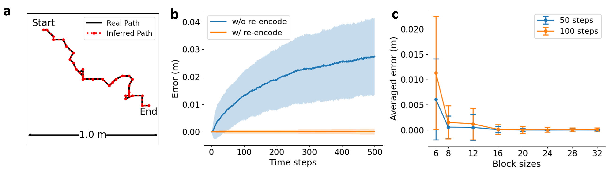

# On Path Integration of Grid Cells: Group Representation and Isotropic Scaling

This repo contains the official implementation for the paper [On Path Integration of Grid Cells: Group Representation and Isotropic Scaling](https://arxiv.org/abs/2006.10259) (NeurIPS 2021)

by [Ruiqi Gao](http://www.stat.ucla.edu/~ruiqigao/), [Jianwen Xie](http://www.stat.ucla.edu/~jxie/), [Xue-Xin Wei](https://sites.google.com/view/xxweineuraltheory/research?authuser=0), [Song-Chun Zhu](http://www.stat.ucla.edu/~sczhu/), and [Ying Nian Wu](http://www.stat.ucla.edu/~ywu/research.html)

--------------------

Our model learns clear hexagon grid patterns of multiple scales which share observed properties of the grid cells in the rodent brain, by optimizing a simple loss function:


The learned model is also capable of accurate long distance path integration:



## Dependencies

* Python >= 3.5

Run the following to install a set of python packages necessary for running the code:
```sh
pip install -r requirements.txt
```

## Usage

Train and evaluate our model through `main.py`.
```sh
python3 main.py
  --mode: <train|visualize|path_integration|error_correction> 
    (running mode: train / visualize filters / path integration / error correction)
  --ckpt: ckeckpoint file to load
    (default: None)
```

* For training the model from scratch, set `--mode=train` and `--ckpt=None`.
* For the other three modes, the path of a ckeckpoint file is required to set to `--ckpt`.

## References

If you find the code useful for your research, please consider citing
```bib
@article{gao2020path,
  title={On Path Integration of Grid Cells: Group Representation and Isotropic Scaling},
  author={Gao, Ruiqi and Xie, Jianwen and Wei, Xue-Xin and Zhu, Song-Chun and Wu, Ying Nian},
  journal={arXiv preprint arXiv:2006.10259},
  year={2020}
}
```

This work is built upon a previous paper which might also interest you:

* Gao, Ruiqi, Jianwen Xie, Song-Chun Zhu, and Ying Nian Wu. "Learning grid cells as vector representation of self-position coupled with matrix representation of self-motion." *International Conference on Learning Representations*, 2019.